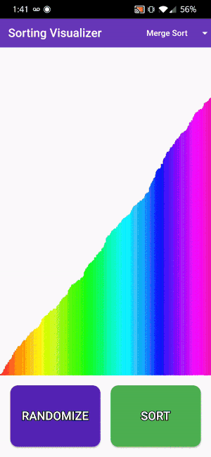

# sorting_algo_visualizer

A simple app built with Flutter to demonstrate how the different sorting algorithms work visually!

Currently implemented algorithms:
- Bubble Sort
- Insertion Sort
- Selection Sort
- Merge Sort

## Example

## How to Run

1. Clone this repo
2. Follow the Flutter installation steps found [here](https://flutter.dev/docs/get-started/install).
3. Run the command `flutter run --release`